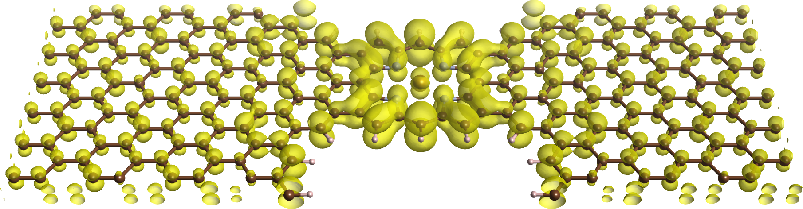

# Matlab下的电子输运器件模拟

## 1. 介绍(钱利江)

## 2. 表象选择(袁莹)

## 3. 平衡态输运
###    3.1 周期性边条件
###    3.2 格林函数　(以上李惟驹)
###    3.3 自能　　
###    3.4 展宽
###    3.5 不相容原理

## 4. 相干输运(袁莹)

公式范例 
$$ G=(ES-H-\Sigma_L- \Sigma_R)^{-1} $$ 　　

## 参考资料

- [学习 markdown](https://guides.github.com/features/mastering-markdown/)
