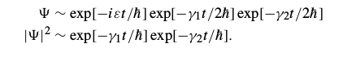

# Matlab下的电子输运器件模拟

## 1. 介绍(钱利江)

## 2. 表象选择(袁莹)

在量子输运理论公式化中，可以依据手上的问题来选取表象，本征态表象的优点在于它的哈密顿量是对角化的。另外，实空间表象直观上也更吸引人（因为人生活在其
中）。在处理1D器件中，我们发现在横向（y-z）上使用本征态表象，纵向（x）上使用离散实空间格子表象比较方便。我们可以把总的哈密顿量分成横向哈密顿量和纵向哈
密顿量。     
  
   
* 横向处理：
对器件来说，当横截面很大（有效无限大）时，通常忽略横向束缚电势,并且使用周期性边界条件.横向本征态可用平面波函数表示，如下:

   
* 纵向处理：
使用实空间离散晶格法。最简单的表示纵向哈密顿是对公式（2.1）的二阶偏导实行有限差分近似。 
其中，。则纵向哈密顿量的矩阵表示如下：

如果选取的a的值极小足以t超出我们所感兴趣的范围，那么离散格点表象会产生相当精确地结果。对于一个无限长均匀的结构来说（Un=0）,它的色散关系退化到抛物线能
带结构，色散关系如下：
     
总的基函数可以用图4B中的（k,n）来标记，矩阵中的元素表示（H+U）

*要注意的是*:
k是本征态，故矩阵的非对角元素为零，它代表连接两个不同的传输模式k和k'。只要我们忽略耦合不同传输模式的弹性或非弹性散射过程，我们可以把横向传输模式当成平
行连接的一维器件。每一个传输模式k都产生一个传输能量.在计算总能时直接把此能量加到纵向能量上即可。当然不同的器件横向传输模式不同，具体
器件具体分析。

*重要数据参数*:

a=0.3nm,
n++:Nd=10^(20)cm^(-3),L(n++)=4.5nm,格点数N=15
n+:Nd=5*10^(19)cm^(-3),L(n+)=21nm,格点数N=70。故总格点数为100。

## 3. 平衡态输运
一旦我们选择合适的表象，我们就准备去计算1D器件平衡带相谱。计算方法可以用两种方法，一种是使用格林函数的概念，另一种则没有，并且两者的对比是很有益处的。
我们将在这一节用图4A表示的n++-n+-n++的例子来说明。这个研究也将有助于介绍自能sigma1和sigma2——描述器件连接点联系，如图2。
如图1B处，平衡问题能够通过解Poison方程自洽和统计力学平衡态法则——要求器件的所有本征态根据费米函数被填充。这意味着特定的横向模式'k'的平衡态密度矩阵可
以被写成
。
 下标‘es’表示密度矩阵表示在本征态表象下：sig1和sig2等是纵向哈密顿量HL的本征能量，而sigk是横向哈密顿量HT的本征能量。因为所有横向模式'k'像独立的平行
 器件，我们需要用密度矩阵来求'k'总和。
。
。
等式3.3中计算f0时我们已经包含了spins的和。尽管费米函数fo被对数函数Fo代替，
K（总和）矩阵[rho]看上去就像{rhok}，这种简单的替换对y-z平面上的横向模式很有好处。否则我们只能当它仅是一个一维问题在x方向上进行计算。
为了获得实空间的密度矩阵（对角元代表电子密度，见等式1.17），我们须进行一个单一变换
。   
矩阵V的纵向呆滞HL在每一个分立格点上的特征向量。一旦我们设好了代表Hl的矩阵，根据等式2.5打方法，在matlab上用3个命令就可以得到实空间密度矩阵
。
。
矩阵D的对角元代表HL的本征值，矩阵V的纵向是对应的特征向量，第一个命令计算这两个矩阵，第二个和第三个命令对应地执行等式3.2和3.4。实际上如果你注意到密度
矩阵可以写成。
图1
用一个命令就可以达到同样效果：
图2        。
   等式3.5把密度矩阵表示为哈密顿量矩阵的方程，对3.2和3.4来说是等价的，因为求解一个矩阵方程的步骤是先找一个矩阵是对角化的表象写下方程，然后将它变换回
   之前的表象。用一个命令和三个的计算时间是一样的，但等式3.5是有概念性的价值的：它说明平衡态密度矩阵仅仅是哈密顿量矩阵在任意表象下的费米函数。这个概念
   对接下来的工作很重要。

 
###    3.1 周期性边条件
   我们用泊松方程
。

和牛顿-拉斐逊方法（见例，附录C，Ref3）自恰地解等式3.5，来获得如图5所示的平衡态势能U（x）分布和电子密度。注意如果我们用2.5式给出的矩阵HL，我们会发现
电子的动量分布在器件的末端变为0，因为使用HL时已经隐含了特定的边界条件。用有限差分法在分立晶格下得到晶格最左边薛定谔方程如下式
。
为了使得HL简化为一个有限大小的矩阵我们需要消除fi0。类似地，器件最右边
。
fin+1也需要消除。如果令fin0= fin(N+1)=0来简化矩阵则末端的电子密度变为0。如果在无限深势阱内这就是一个合理的边界条件。但实际上边界条件是开放的，令
HL（1,N）=HL（N，1）=-t，使得边界条件变为周期性的则更好。这时电子密度在边界处变为一个恒定的较大的值。本节接下来要讨论的自能方法允许我们这样做。不过
我们首先要讨论计算密度矩阵的格林函数法。
###    3.2 格林函数　
将3.5式写成如下形式
。
使用delta函数的标准表示法（0+：正无穷小）
。
我们有。
等式3.8 3.9 可以被写成如下形式
。
 A为已知谱函数
。
G作为迟滞格林函数由下式定义
。
3.10告诉我们可将谱函数A(E)/2pi看成由费米函数填充的态密度以便获得电子密度。事实上AE/2pi在实空间表象的对角元代表在空间不同位置处的态密度（一个可观测
量）等式3.10代表3.5的格林函数形式。引入一个不必要的integration over the energy coordinate，E使得形式变得复杂但给处理开放系统带来了便利。其实如
果我们只关注封闭系统那么没必要用格林函数。但对于开放系统来说，尽管结点实际上是很大的，格林函数法使得我们只需要关注我们感兴趣的器件并允许我们用自能方程
gama代替所有外部结点的影响，gama12s是器件哈密顿量的合称。这是我们将要讨论的多体物理的基础概念。
Fig6 库 对器件的影响用自能矩阵gama表示。
###    3.3 自能　　
在多体物理中，自能的概念被用来描述电子-电子和电子-声子之间的相互作用。但后文中，我们将使用这个概念去描述一些更简单的事情，也就是半无穷大触点上的作用。
物理规律对二者都适用。一般而言，我们有一个连接到一个巨大的库的器件，所有的哈密顿量用下式表示。
。
Hr和H具有相同的维度。格林函数具有如下形式。
。
我们只对G感兴趣而不考虑XXXXX。因为我们只想探究期间内部的情况，库内部的情况可以忽略。
显然
。
当
。
这说明耦合矩阵对库的影响可以通过添加一个自能矩阵sigema到哈密顿量H上。这个普适概念使得我们可以不考虑巨大的库而仅仅在尺度非常小的物质器件内部进行探究。
需要注意的是sigema未必三一个无穷小量（不像0+），对库的耦合矩阵来说它可以是一个有限的数值。这一一节的最后我们将讨论sigema的更深层的物理意义。
 我们可以用等式3.14来计算任意库以及耦合矩阵的自能tao。貌似我们没有获得什么信息因为我们需要对一个巨大的矩阵求逆来获得Gr
。
下标mn用来标记器件，miuniu用来标记库。耦合矩阵tao用来联结期间内的点和库表面的少量点。所以我们只需要Gr来计算那些表面上的点。表面上的格林函数经常通过
给定一个库的模型来进行定性计算。
      对于我们所涉及的简单的一维问题，自能可以通过初等方法直接获得，不需要用到表面格林函数。将导线视为半无限长的，则代表它的自能矩阵由下式给出。
。
其中。代表半无限的lead的HL上。
我们可以用初等方法来得到结果。我们之前已经讨论过边界上的核心问题所如何消除下式的fi0!
换言之，对计算格林函数来说，我只需要们加一项-t*exp(ik1a)
。

在无限深势垒的情况下我们令fi0=0,周期性边界条件下我们lingfi0=fin。在自能方法中我们假设边界上只存在出来的波。实际上要计算G的话在边界处是存在由不相关因
素导致的向内的波的。G是代表在器件内部系统对冲击的响应的迟滞函数。  
因此对G来说恰当的边界条件所我们在边界处只有向外的波。这样我们在计算G的时候我们可以直接得到
。
因此等式37变为。
上式说明加入-texp项后我们就只需要关心开放边界条件了。同样地，右边的半无限长导线的自能矩阵sigma2只在N点处有一个非0 项 ，由下式给出
。
。
格林函数由下式得到。
上式中自能矩阵sigma1和sigma2 由开放边界条件得到。3.10能够得出3.11的电子密度，进而得到普函数A（E）。从图5中我们可以看出结果与使用周期性边界条件直接
得到的结果很吻合。自能方法数值上更加精确，因为它需要能量的积分，图5是看不出这种方法的优势的。需要注意的是周期性边界条件仅仅是通过把期间假想为一个环来
避免末端效应的影响，自能方法对开放边界条件也是这样。开放系统有连续的能量谱，而环的能量谱是分立的。电子密度由能量积分得到，而且至少在室温下 ，不太受谱
分立的影响。但如果我们要观测谱函数的态密度，区别就会很明显。当器件上存在偏压时自能方法的优势就变得明显----周期性边界条件无法解决问题。
###    3.4 展宽
自能方法其实就是另外一种解决边界效应的方法，无限深势垒条件下我们令fi =fi(N+1)0周期性边界提条件下令fi0=fiN;自能方法中我们令             ，                       
。sigma1和sigma2有两个显著特点，与能量无关并且不是厄米的。所以我们可以有
。
其中 。
。
自能项 使得hl 变成HLbar ，改变了本征态和它们的能量，还通过边界方程sigma1 和sigma2引入了一个虚部。前者代表一个小的数值变化，后者代表一个概念性的变
化。
一种理解这些方程含义的方法是想象一个对角化HL的表象。这个表象不一定非要队角化tao1和tao2——事实上有价值的量子干涉效应往往来自于tao1tao2中的非对角元
素。但如果tao1和tao2同为对角化的，	本征能量由下式给出
。
其中gama1和gama2 是HL tao1tao2中对应的对角元。这可以被看作一个从delta函数变成如下式的一条线的能级展宽。
。
它可以不所洛仑兹形式因为 gama1和gama2一般来与能量无关。
    虚部的含义是波函数和可能性随时间的衰减可以被写成如下形式（不考虑与gama1和gama2无关的能量）。
。
开始处于这个态的电子将会以固定的时间    hbar/gama1进入到左导线，hbar/gama2进入到右导线。因此  和   的数值代表处于特定态的电子进入到左右导线的时
间。举个例子，我们已经知道一维导线给出一简单的实部对角的表象
。
这是合理的因为我们预期通过一个晶格常数为a的晶格的速度是v/a。
###    3.5 不相容原理(以上杨旸）
在计算电极到库的能级展宽时，结果似乎以来于库是否被占据。考虑一个与库耦合的处于费米能级的分立能级，有人认为与库的态相对应的能级是没有被占据的（情况a）
展宽会比能级是被占据的（情况b）更宽。毕竟处于这个能级的电子在情况b下受泡利不相容原理的限制是无法离开的，所以能级也无法被扩展。综上所述，能及展宽由下式
给出。
 。      
但是，这个观点是不正确的，因为处于该能级的空穴在情况b时会进入到库中，在情况a时会被限制，这意味着展宽会是 
 。                                                   （空穴离开或电子进入速率）
如果我们之前描述的是空穴的增加而不是电子。正确的观点是电子和空穴由相同的自能描述，它们打展宽由电子进入速率和离开速率的总和描述：
。
因此展宽与库的占据状态无关。
## 4. 相干输运(袁莹)

公式范例 
$$ G=(ES-H-\Sigma_L- \Sigma_R)^{-1} $$ 　　

## 参考资料

- [学习 markdown](https://guides.github.com/features/mastering-markdown/)
