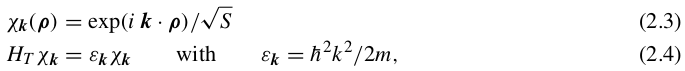
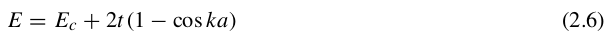

# Matlab下的电子输运器件模拟

## 1. 介绍(钱利江)

## 2. 表象选择(袁莹)

在量子输运理论公式化中，可以依据手上的问题来选取表象，本征态表象的优点在于它的哈密顿量是对角化的。另外，实空间表象直观上也更吸引人（因为人生活在其中）。在处理1D器件中，我们发现在横向（y-z）上使用本征态表象，纵向（x）上使用离散实空间格子表象比较方便。我们可以把总的哈密顿量分成横向哈密顿量和纵向哈密顿量。     
  

* 横向处理：
对器件来说，当横截面很大（有效无限大）时，通常忽略横向束缚电势,并且使用周期性边界条件.横向本征态可用平面波函数表示，如下:

* 纵向处理：
使用实空间离散晶格法。最简单的表示纵向哈密顿是对公式（2.1）的二阶偏导实行有限差分近似。 
其中，。则纵向哈密顿量的矩阵表示如下：

如果选取的a的值极小足以t超出我们所感兴趣的范围，那么离散格点表象会产生相当精确地结果。对于一个无限长均匀的结构来说（Un=0）,它的色散关系退化到抛物线能带结构，色散关系如下：
     
总的基函数可以用图4B中的（k,n）来标记，矩阵中的元素表示（H+U）

*要注意的是*:
k是本征态，故矩阵的非对角元素为零，它代表连接两个不同的传输模式k和k'。只要我们忽略耦合不同传输模式的弹性或非弹性散射过程，我们可以把横向传输模式当成平行连接的一维器件。每一个传输模式k都产生一个传输能量.在计算总能时直接把此能量加到纵向能量上即可。当然不同的器件横向传输模式不同，具体器件具体分析。
*重要数据参数*:

a=0.3nm,
n++:Nd=10^(20)cm^(-3),L(n++)=4.5nm,格点数N=15
n+:Nd=5*10^(19)cm^(-3),L(n+)=21nm,格点数N=70。故总格点数为100。

## 3. 平衡态输运
一旦我们选择合适的表象，我们就准备去计算1D器件平衡带相谱。计算方法可以用两种方法，一种是使用格林函数的概念，另一种则没有，并且两者的对比是很有益处的。
我们将在这一节用图4A表示的n++-n+-n++的例子来说明。这个研究也将有助于介绍自能sigma1和sigma2——描述器件连接点联系，如图2。
如图1B处，平衡问题能够通过解Poison方程自洽和统计力学平衡态法则——要求器件的所有本征态根据费米函数被填充。这意味着特定的横向模式'k'的平衡态密度矩阵可以被写成[(rho)k]es=[f0(sig1+sigk-miu)  0                  0                  ...
                  0                   f0(sif2+sigk-miu)  0                  ...
                  0                   0                  f0(sig3+sigk-miu)  ...
                  ...                 ...                ...                ...]
 下标‘es’表示密度矩阵表示在本征态表象下：sig1和sig2等是纵向哈密顿量HL的本征能量，而sigk是横向哈密顿量HT的本征能量。因为所有横向模式'k'像独立的平行器件，我们需要用密度矩阵来求'k'总和。

 
###    3.1 周期性边条件
###    3.2 格林函数　(以上李惟驹)
###    3.3 自能　　
###    3.4 展宽
###    3.5 不相容原理(以上杨旸）

## 4. 相干输运(袁莹)

公式范例 
$$ G=(ES-H-\Sigma_L- \Sigma_R)^{-1} $$ 　　

## 参考资料

- [学习 markdown](https://guides.github.com/features/mastering-markdown/)
